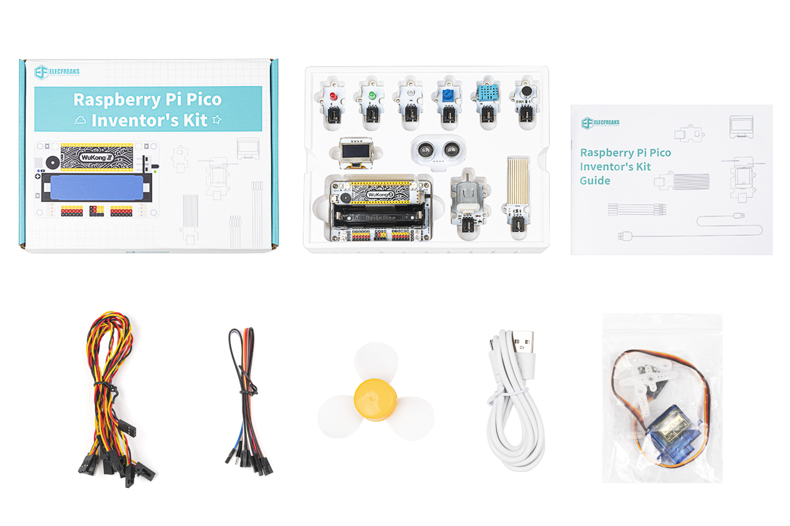
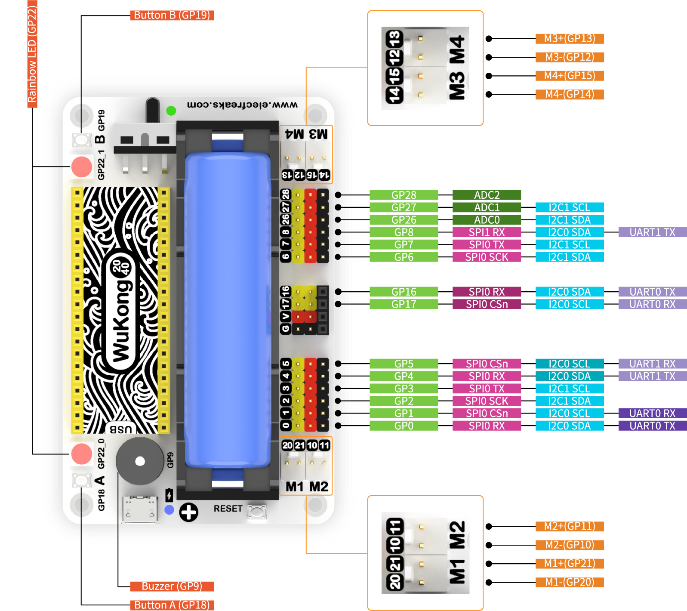

# Wukong2040 Inventor's Kit Introduction

## Introduction

The Wukong2040 Inventor's Kit is a kit developed for inventors learning to program electronics. It includes a multifunctional expansion board-the Wukong2040, designed for the Raspberry Pi Pico, as well as 11 different types of sensors and actuators to create a wide range of interesting and practical projects.

The Wukong2040 Inventor's Kit supports MicroBlocks graphical programming, making it easy for beginners with no experience in electronics programming to get started and learn about programming as fast as possible. The Wukong2040 expansion board, developed by the team at ELECFREAKS, features a modular design with powerful on-board functionality for experienced creators to explore the CircuitPython code programming style in greater depth and create projects quickly.

What's more, the team at ELECFREAKS provides you with a wealth of learning examples that can help you quickly navigate the world of creators and apply them to real-life situations.

## Packing List

## Powerful Wukong2040

The **Wukong2040** is a multifunctional expansion board for the Raspberry Pi Pico.

It features an onboard buzzer, A\B button, rainbow light, motor interface, reset button and more to satisfy creators' IO programming and peripheral expansion needs.

In terms of battery life, it supports high-capacity 18650 batteries and has an onboard intelligent power management chip with a thoughtful power indicator, which can last for over 120 minutes of normal use.

In terms of construction, it uses a standard 7 x 11 square block frame as its base, allowing the Wukong2040 to be extended in a variety of vivid shapes.

> The Raspberry Pi Pico is a high performance, small form factor microcontroller development board designed by Raspberry Pi. Powered by Raspberry Pi's own RP2040 microcontroller chip, it features an ARM Cortex M0 + dual-core processor running at up to 133MHz, 264KB of SRAM and 2MB of memory, and up to 26 multi-function GPIO pins on board.

## Introduction to the sensors

| Item                            | Information                                                  | Picture                                                |
| ------------------------------- | ------------------------------------------------------------ | ------------------------------------------------------ |
| LED Light                       | LED lights are solid-state semiconductor devices capable of converting electrical energy into visible light. |  |
| Motor Fan                       | The motor is an actuating device that drives the fan.        |  |
| 180° Servo                      | The 180° servo can be rotated at an angle of (0° to 180°).   |  |
| OLED Display                    | The OLED display is a self-illuminating display with a high screen-to-body ratio and high contrast ratio. |  |
| Ultrasonic Sensor               | The ultrasonic out sensor is an analogue input type sensor that can be used for short distance measurement applications. |  |
| Light Sensor                    | The light sensor is an analogue input type sensor and its detection value is a direct reflection of the light intensity value. |  |
| Temperature and Humidity Sensor | The temperature and humidity sensor is an analogue input type sensor which is based on the DHT11 digital temperature and humidity. |  |
| Water Level Sensor              | The water level sensor easily converts water to analogue signals by means of a series of exposed parallel wires. |  |
| Noise Sensor                    | The noise sensor detects the current ambient noise decibel level. |  |
| Trimpot Sensor                  | The trimpot sensor changes the resistance value by turning the potentiometer knob. |  |

## Pins Diagram of Wukong2040

##  Pins Diagram of Raspberry Pi Pico

## Relevant Links

[Link to documentation on the Wukong 24040 expansion board](http://www.elecfreaks.com/learn/pico/extension-module/wukong2040-pico).

[Raspberry Pi Pico official website link](https://www.raspberrypi.com/products/raspberry-pi-pico/).

[MicroBlocks official website link](https://microblocks.fun/).

[CircuitPython official website link](https://circuitpython.org/).
