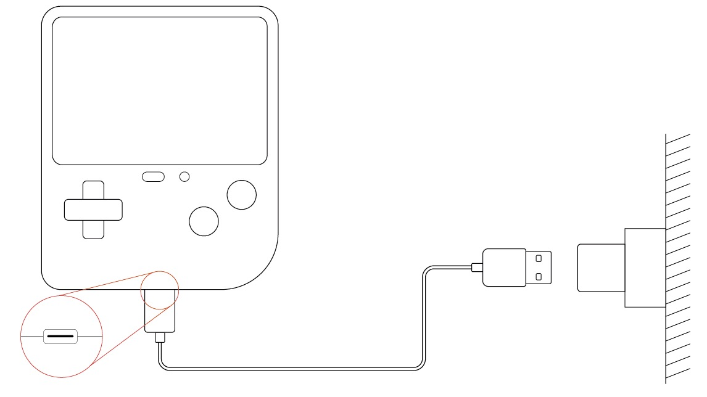

# Product Description

## Overview

The Retro Makecode Arcade For Education is the world's first game programming learning machine with a large, ultra-clear screen. It is specially designed for children's hand size with a dazzling color shell and silicone buttons, which gives a comfortable feel and easy to grip; it has a 320*240 color super-clear screen, which raises the resolution to four times the industry level; it has rich built-in sensors such as the gravity sensor, vibration sensor, sound sensor and light sensor to make programming more cool.

It helps children write their own games and understand the mystery behind the game in a simple and fun way. It also supports custom game characters, diverse scenarios and plot design using graphical programming software, making it easy for everyone to achieve fun electronic creations and unlimited game ideas.

The Retro Makecode Arcade for Education makes kids fall in love with programming, not the game itself.

## Purchase Link

 [ELECFREAKS Retro Makecode Arcade For Education](https://item.taobao.com/item.htm?spm=a1z10.5-c-s.w4002-18602834185.82.51a95ccfE1IJt1&id=644090757603)

## Product Description

### Product parameters
| Product Name | Retro Makecode Arcade For Education |
| --- | --- |
| Rated voltage | 3.7V |
| Battery Capacity | 560mAH |
| Charging voltage | 5V |
| Charging current | 1.35A |
| Charging port | Type-C |
| Screen size | 2.4 inches |
| Display Resolution | 320 × 240 |
| Built-in sensors | Buzzer, light sensor, gyroscope, vibration motor |
| Bricks compatible | Support |

### Switching Method
Click the on/off button to start the product and double click the on/off button to turn off it.

### Charging Method
Use the standard Type-C with data transfer interface, connect the USB port with your own USB charger to charge. Charger specifications should be DC5V/1A output and above. The power indicator flashes while charging, and the power indicator is always on when charging is complete. The expected charging time is 1.5H.

### Indicator Status
| At work | Always bright | Plenty of power |
| --- | --- | --- |
|  | Blinking | Low Battery |
| Charging | Always bright | Charging completed |
|  | Blinking | Charging in progress |

## Software Programming Platform
Microsoft makecode: [https://arcade.makecode.com/](https://arcade.makecode.com/)
