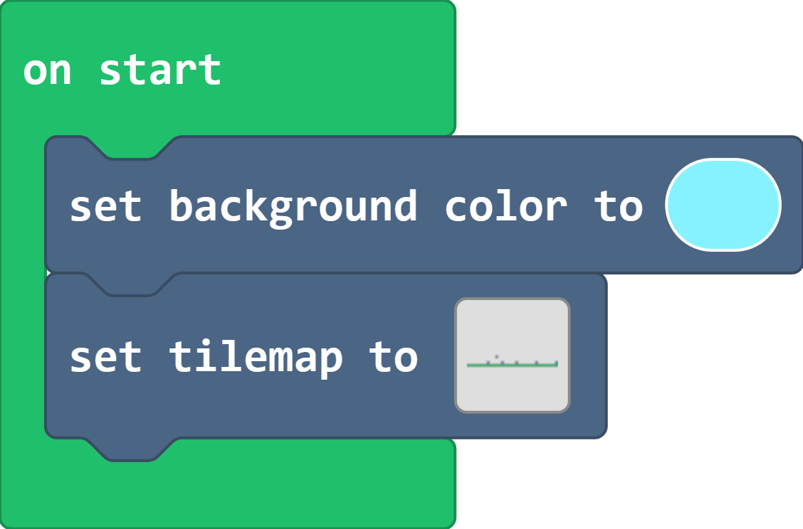
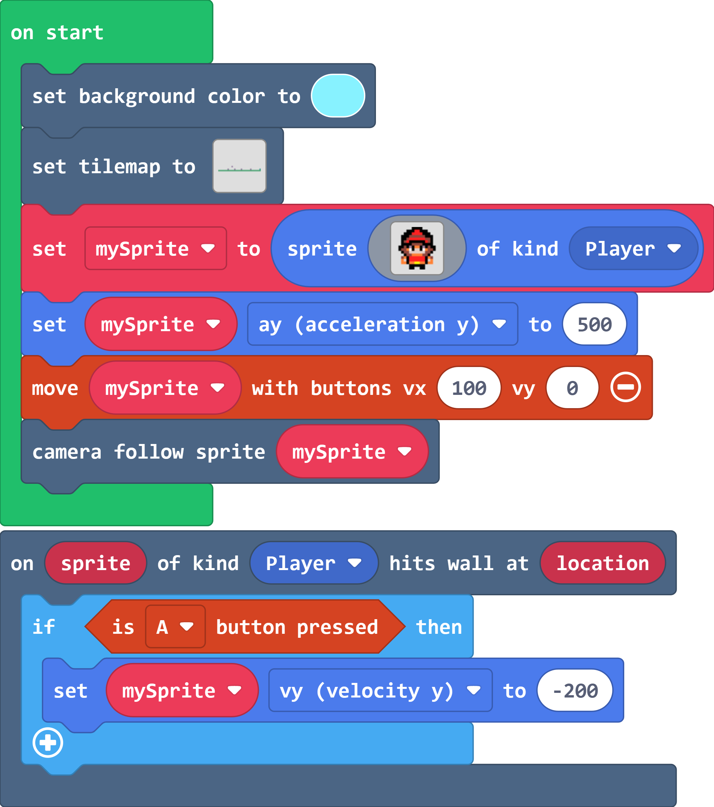

# Case 04:Little heroes (1)

##  Purpose

Learn to control the character's lateral movement, jumping, and scene creation.

## Materials Requested

1 x  [ELECFREAKS Retro Makecode Arcade For Education](https://item.taobao.com/item.htm?spm=a1z10.5-c-s.w4002-18602834185.82.51a95ccfE1IJt1&id=644090757603)

## Software

[Microsoft makecode](https://arcade.makecode.com/)

## Programming

Set the background color and set the block map.

Set the sprite, set the y-axis acceleration of the sprite, and set the y-axis velocity to 0 by moving the sprite with the button.

Set the camera to follow the sprite movement and set the sprite jump function.

### Procedures

Link: [https://makecode.com/_EzzHsgdVhecH](https://makecode.com/_EzzHsgdVhecH)

You can also download the program directly from the following pages.

You may download it directly below:

    <iframe
        src="https://makecode.com/_EzzHsgdVhecH"
        frameborder="0"
        sandbox="allow-popups allow-forms allow-scripts allow-same-origin"
        style={{
            position: 'absolute',
            width: '100%',
            height: '100%',
        }}
    />

## Program Download

Please see the documentation for the program download: [Program Download Method](http://wiki.elecfreaks.com/en/retroarcade/program-download-method)

## Conclusion

You can control the sprite to move laterally and jump in the custom scene by pressing the button.
