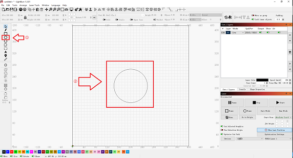

# LightBurn User Guide

## Preparation

Use a dust-free cloth with alcohol to wipe the protective lens of the laser module before engraving to ensure the best engraving effect.

Put down the wooden board in the working area of TOOCA L1 Laser Engraver, lower the fixing bar, loosen the hand screw on the side of the laser module, and adjust the focus.

The focus bar should be in contact with the surface of the engraving material when it is naturally vertical and downward, use the hand screw on the right side to lock it tightly, and toggle the focus bar clockwise until it is attracted by the magnet. Finally, plug in the laser module cable.

Insert the TF card into the PC.

Double-click the .exe file to install the LightBurn software (the installer inside the TF card is only compatible with Windows 64-bit systems, for other versions, please visit the official website) [https://lightburnsoftware.com/](https://lightburnsoftware.com/)  to download。
Note: The free trial period of the software is 30 days, please visit for details of purchasing serial number [https://lightburnsoft-ware.com/collections/frontpage/products/lightburn-gcode](https://lightburnsoft-ware.com/collections/frontpage/products/lightburn-gcode)

Download the configuration file: [TOOCA-Laser-1.7z](https://github.com/elecfreaks/learn-en/raw/master/tooca-laser-1/file/TOOCA%20Laser%201.7z), and decompress it

**Note: In order to protect the table or floor from being burned or smoked, please take care of protecting the table (such as matting the steel plate and other materials that the laser does not easily penetrate), and when laser cutting is carried out, the bottom of the cutting place should be overhanging to ensure the cutting effect.**

1. Double-click to open the LightBurn software and click on "Devices".
2. Click "Import" to import the .lbdev configuration file from the TF card: [TOOCA-Laser-1.7z](https://github.com/elecfreaks/learn-en/raw/master/tooca-laser-1/file/TOOCA%20Laser%201.7z), after importing, there is a corresponding machine in the device list, select the machine and click OK to configure successfully.

3. Click "Edit - Settings".

4. Select "mm/min" and click OK.

## LightBurn-Flat surface processing

1. Draw a circle on LightBurn's canvas.
2. For setting parameters, please refer to [Recommended Parameters](http://www.elecfreaks.com/learn/tooca-laser-1/recommended-parameters), and set according to the actual material used.

3. Click on the border to check if the pattern to be engraved is within the expected area of the material.

4. Select the graphics to be cut and click Save GCode to save the engraving file to the root directory of the TF card

5. Put the TF card into the card slot of TOOCA L1 Laser Engraver.

Turn on the power and turn on the switch, wait for the machine initialization to complete, press the micro switch to enter the preview mode.

Press the micro switch again to start engraving.

## LightBurn-Image Engraving

1. Click "File - Import" to import pictures.

2. Set the position, size and rotation angle of the image.

3. Right-click the image and select Adjust Image.

4. Set the image effect, and then click OK.

Reference [Recommended parameters](http://www.elecfreaks.com/learn-en/tooca-laser-1/recommended-parameters.html) to set the power, speed, and number of times.

Note: The greater the power is, or the slower the speed is, the deeper the carving effect will be; the smaller the power is, or the faster the speed is, the shallower the carving effect will be. Power Max can be adjusted in general. Matching recommended parameters for linden wood board carving: Minimum power-5.00 Maximum power-70.00 Speed (mm/m)-6000.

5. Click Save GCode to save the engraving file to the root directory of the TF card.

Note: Please make sure the file format is .gcode, other formats such as .gc/.nc will not be recognized by the plotter.

6. Put the TF card into the card slot of TOOCA L1 Laser Engraver.

Turn on the power and turn on the switch, wait for the machine initialization to complete, press the micro switch to enter the preview mode.

Press the micro switch again to start engraving.

## LightBurn-Image Tracking

1. Click "File-Import" to import the image, and then set the position, size and rotation angle of the image.

2. Right-click the image, select Trace Image to set the image effect, and then click OK.

3. Set the appropriate power %, speed and number of times.
Note: The larger the power% is, or the slower the speed is, the deeper the engraving effect will be; the smaller the power% is, or the faster the speed is, the shallower the engraving effect will be. Power% is generally adjusted to Power Max. Matching recommended parameters for linden wood board carving: Minimum power-5.00 Maximum power-70.00 Speed (mm/m)-6000.

4. Finally, click Save GCode to save the engraving file to TF card.

Note: Please make sure the file format is .gcode, other formats such as .gc/.nc will not be recognized by the plotter.

In addition, you can also connect your engraving machine via Type-C for real-time engraving. For more detailed tutorials on how to use the software, please refer to
https://lightburnsoftware.github.io/NewDocs/
