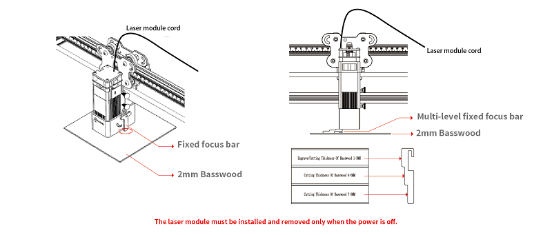
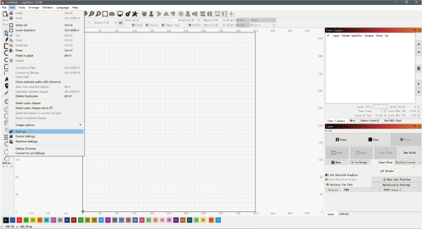

# LightBurn User Guide

Use a dust-free cloth with alcohol to wipe the protective lens of the laser module before engraving to ensure the best engraving effect.

Place the wooden board in the working area of TOOCA L1 Laser Engraver, put down the fixing strip and loosen the screw on the side of the laser module for focusing.

The fixed focus bar should be in contact with the surface of the engraving material when it is naturally vertically downward. Use the screw on the right side to fasten it, and turn the fixed focus bar clockwise until it is attracted by the magnet. Finally plug in the laser module line.

**Attention: In order to protect the table or floor from being burned or smoked, please protect the worktable well(use materials such as padding steel plates and other materials that are not easily penetrated by lasers). When doing the laser cutting, the bottom surface of the cutting place should be suspended to ensure the cutting effect.
**

## LightBurn Software Manual

Double-click the .exe to install LightBurn (the installer in the TF card is only
compatible with Windows 64-bit systems. Please visit the official website
https://lightburnsoftware.com/ for other versions.
Notes: The free trial period of the software is 1 month. Visit https://lightburnsoftware.com/collections/frontpage/products/lightburn-gcode
for permanent serial number.

 Open LightBurn by double-clicking after installation. Click “Devices”.

Import the .lbdev configuration file in the TF card by clicking "Import". There is a corresponding
machine in your device list after importing the configuration file. Select the
machine and click OK to complete the configuration.

Configuration file:[TOOCA-Laser-1.7z](https://github.com/elecfreaks/learn-en/raw/master/tooca-laser-1/file/TOOCA%20Laser%201.7z)

Click “Edit-Settings”.

Select “mm/min”and click OK.

Click “File-Import” to import the pictures.

Set the position, size and rotation angle of the pictures.

Right click on the image and select "Adjust Image".

Set the effect of the image and click OK.

Reference [Recommended parameters](http://www.elecfreaks.com/learn-en/tooca-laser-1/recommended-parameters.html)Set the appropriate Power %, speed and pass count.

Notes: Higher power % or slower speed makes deeper effect; lower power % or faster speed
makes shallower effect. Generally we can just adjust “Power Max”. Recommended parameters for matching basswood: Power Min - 5.00; Power Max - 70.00; Speed(mm/m) - 6000.

Click “File-Save GCode” to save the engraving file to the TF card.

Attention: Make sure the exported format of the file be .gcode, other formats such as .gc/.nc cannot be identified.

Place the TF Card to the card slot on Tooca Laser 1.

Power on the device and turn on the switch, wait for the initialization of the machine to complete, press the micro switch to enter the preview mode.
Press the micro switch again to start engraving.

Besides these references, you can also connect the machine with Type-C to do real-time engrave, for more details please can visit:
https://lightburnsoftware.github.io/NewDocs/

## LightBurn-Trace Image

Double-click the .exe file to install the LightBurn software (the installer inside the TF card is only compatible with Windows 64-bit systems, other versions)
Please visit the official website at https://lightburnsoftware.com/ to download.

Note: The free trial period for this software is 1 month, for details on purchasing the serial number, please visit https://lightburnsoft-
ware.com/collections/frontpage/products/lightburn-gcode

After successful installation, double click to open the LightBurn software and click "Import" to import the .lbdev configuration file from the TF card.

After importing, there is a corresponding machine in the device list, select the machine and click OK to configure successfully.

Click "Edit-Setting", select "mm/min", and click OK.

Click "File-Import" to import the image, and then set the position, size and rotation angle of the image.

Right-click the image, select Trace Image to set the image effect, and then click OK.

Set the appropriate power%, speed and number of times.
Note: The larger the power% is, or the slower the speed is, the deeper the engraving effect will be; the smaller the power% is, or the faster the speed is, the shallower the engraving effect will be. Power% is generally adjusted to Power
Max can be adjusted. Recommended parameters for the matching linden wood board carving: Minimum power-5.00 Maximum power-70.00 Speed (mm/m)-6000.

Finally, click Save GCode to save the engraving file to TF card.

Note: Please make sure the file format is .gcode, other formats such as .gc/.nc will not be recognized by the plotter.

In addition, you can also connect your engraving machine via Type-C for real-time engraving. For more detailed tutorials on how to use the software, please refer to
https://lightburnsoftware.github.io/NewDocs/
